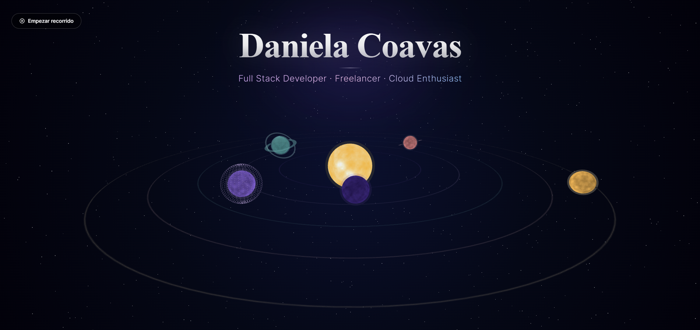

# Portafolio Interactivo 3D 
## Interactive 3D Portfolio

**[Ver Demo en Vivo](https://portafolio-universo.vercel.app/) • [Live Demo](https://portafolio-universo.vercel.app/)**

---

## Español

### Descripción

Portafolio interactivo desarrollado con Next.js 15 y Three.js. Presenta una experiencia única de navegación espacial donde cada sección está representada por un planeta en 3D. El proyecto cuenta con animaciones suaves, diseño totalmente responsive y un sistema de contacto con EmailJS.

### Características

- Navegación 3D Interactiva: Sistema solar navegable con planetas que representan diferentes secciones
- Diseño Responsive: Optimizado para móviles, tablets y escritorio
- Animaciones Suaves: Transiciones fluidas entre secciones y efectos visuales
- UX Mobile-First: Experiencia optimizada para dispositivos móviles
- Formulario de Contacto: Integración con EmailJS para mensajes directos
- Carrusel de Tecnologías: Scroll automático que muestra habilidades técnicas
- Cámara Dinámica: Movimiento panorámico en modo vista universo
- Rendimiento Optimizado: Carga rápida y animaciones a 60fps

### Tecnologías

- **Framework:** Next.js 15 (App Router)
- **UI Library:** React 18
- **Language:** TypeScript
- **3D Graphics:** Three.js + React Three Fiber
- **Styling:** Tailwind CSS
- **Email Service:** EmailJS
- **Deployment:** Vercel

---

## English

### Description

Interactive portfolio built with Next.js 15 and Three.js. It features a unique spatial navigation experience where each section is represented by a 3D planet. The project includes smooth animations, fully responsive design, and a contact system with EmailJS.

### Features

- Interactive 3D Navigation: Navigable solar system with planets that represent different sections
- Responsive Design: Optimized for mobile, tablet, and desktop
- Smooth Animations: Fluid transitions between sections and visual effects
- Mobile-First UX: Optimized experience for mobile devices
- Contact Form: EmailJS integration for direct messaging
- Tech Carousel: Auto-scroll that showcases technical skills
- Dynamic Camera: Panoramic movement in universe view mode
- Optimized Performance: Fast loading and 60fps animations

### Tech Stack

- **Framework:** Next.js 15 (App Router)
- **UI Library:** React 18
- **Language:** TypeScript
- **3D Graphics:** Three.js + React Three Fiber
- **Styling:** Tailwind CSS
- **Email Service:** EmailJS
- **Deployment:** Vercel

---

## Licencia | License

© 2025 Daniela Sophia Coavas Barboza. Todos los derechos reservados.

Este proyecto es de código cerrado y propietario. No está permitido copiar, modificar, distribuir o usar este código sin autorización explícita del autor.

---

© 2025 Daniela Sophia Coavas Barboza. All rights reserved.

This project is closed source and proprietary. Copying, modifying, distributing, or using this code without explicit permission from the author is not allowed.

---

## Autor | Author

**Daniela Sophia Coavas Barboza**

- Portfolio: [https://portafolio-universo.vercel.app](https://portafolio-universo.vercel.app)
- GitHub: [@dannysophi17](https://github.com/dannysophi17)
- Email: danielacoavas@gmail.com

---

Made with 💜 by Daniela Coavas

